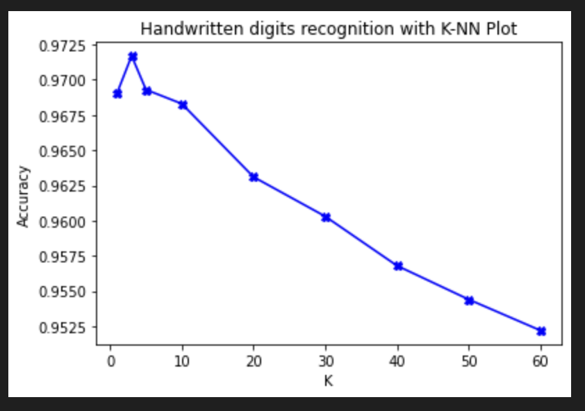
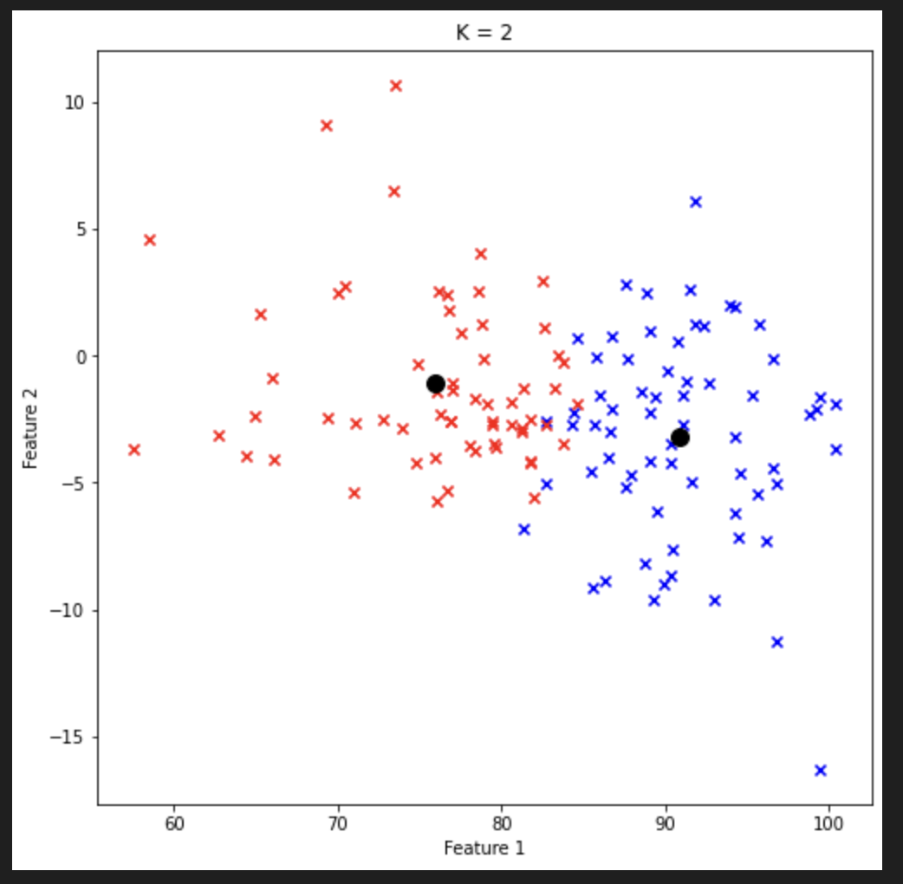
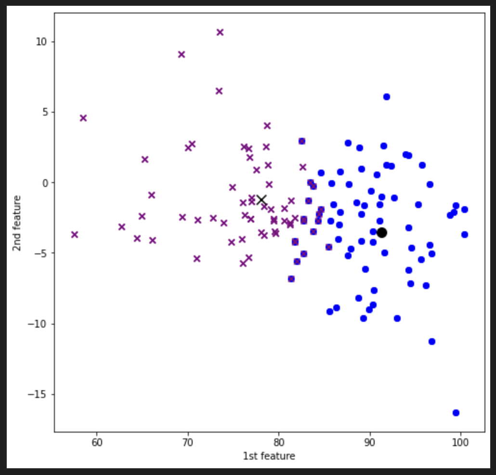

# MLAlgorithmsImplementaion

All the codes are present in `code` folder, resultant images in the `images` folder, dataset is present in `dataset` folder and MNIST dataset is present in `MNIST` folder.

# Implemented and analyzed the k-NN algorithm on the MNIST dataset, focused on efficiency and accuracy.

# MNIST Handwritten Digits Recognition Using k-NN Algorithm

## Data Set
Using the MNIST dataset, which includes training images, training labels, test images, and test labels.

## Objective
Implemented the k-NN algorithm to predict digits in the test set, using Euclidean distance to measure the distance between data points.

## k Values and Accuracy
Calculated the prediction accuracy for various values of k (1, 3, 5, 10, 20, 30, 40, 50, 60). Plotted these accuracies against the values of k.

## Efficiency Tips
- Computed the pairwise distances between each test data point and training data point only once and stored these distances. This avoids recalculating distances for each k value, saving computation time.

# Implemented and analyzed the K-means algorithm, focused on how the clustering changes with different values of K,

## Implementation
Wrote the K-means algorithm from scratch in Python.

## Data Set
Used a dataset which includes 128 data points, each with 13 features. Replaced any missing values in the dataset with the mean of the respective feature. Dataset is present in the current folder under the name `dataset.csv`

## K Values
Ran the algorithm for values of K from 2 to 9.

## Initialization and Termination
Initialized cluster centers randomly from the data points.
Terminated iterations when all data points remain in the same cluster as in the previous iteration (i.e., no change in cluster assignments).

## Plotting and Analysis
Plotted the objective function as a function of K.
Specifically for K=2, plotted the data points using the first two features, using different colors or symbols to distinguish between the two clusters.

# Implement the Gaussian Mixture Model for a given dataset with K set to 2, ensuring convergence based on the change in log-likelihood

## Implementation
Developed the Gaussian Mixture Model from scratch, using Python.

## Data Set
Used a dataset which includes 128 data points, each with 13 features. Dataset is present in the current folder under the name `dataset.csv`

## K Value and Convergence
Ran the algorithm with K=2. Continued iterations until convergence, which is defined as the point where the change in the log-likelihood is less than a specified small threshold (e.g., 1e-5).

## Reference and Resources:
Followed the EM (Expectation-Maximization) algorithm for implementation.

## Plotting and Cluster Assignment:
For K=2, plotted the data points using the first two features. Differentiated the two clusters using distinct colors or symbols.
Determined the cluster assignment of each data point based on the posterior `γ(z_nk)`. Assigned a data point `x_n` to cluster 1 if `γ(z_n1)` is greater than `γ(z_n2)`, and to cluster 2 otherwise.

